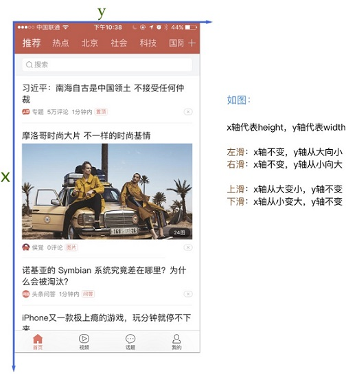

Android屏幕滑动
=================================================

滑动，就是一个点移动另一个点。

用法：

.. code-block:: python

    def swipe(self, start_x, start_y, end_x, end_y, duration=None):
        """Swipe from one point to another point, for an optional duration.

        :Args:
         - start_x - x-coordinate at which to start
         - start_y - y-coordinate at which to start
         - end_x - x-coordinate at which to stop
         - end_y - y-coordinate at which to stop
         - duration - (optional) time to take the swipe, in ms.
        :Usage:
            driver.swipe(100, 100, 100, 400)
        """

获取手机分辨率
--------------------------

.. code-block:: python

    width = driver.get_window_size()['width']
    
    height = driver.get_window_size()['height']

图解：

屏幕左滑
---------------------------

.. code-block:: python

    driver.swipe(height/4*3,width/2,height/4,width/2,800)

屏幕右滑
-------------------------------

.. code-block:: python

    driver.swipe(height/4,width/2,height/4*3,width/2,800)

屏幕下滑
--------------------------------

.. code-block:: python

    driver.swipe(height/2,width/4,height/2,width/4*3,800)

屏幕上滑
--------------------------------

.. code-block:: python

    driver.swipe(height/2,width/4*3,height/2,width/4,800)

